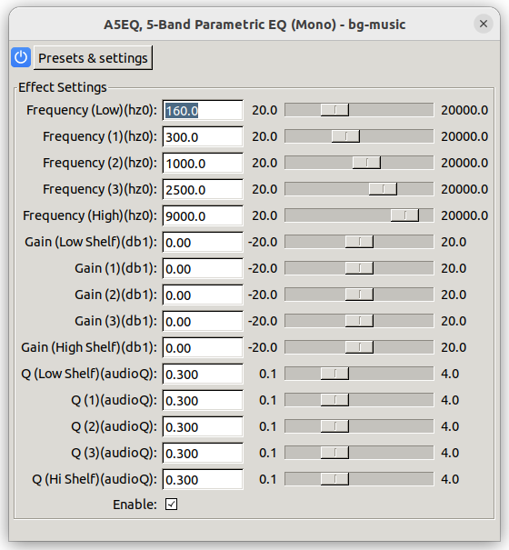

# a5eq.lv2 - Another 5-Band Equalizer

`a5eq.lv2` is an LV2 plugin featuring a 5-band equalizer that includes a Low
Shelf, three Peaking filters, and a High Shelf. It's crafted to assist both
amateur and professional audio engineers in precise sound sculpting and can be
employed across various audio engineering tasks such as studio production,
mastering, or live sound tweaking.

## Features

- **Five Bands of Equalization:**
  - Low Shelf Filter
  - Three Peaking Filters
  - High Shelf Filter
- **Stereo Processing:** Process stereo signals with individual channel
  adjustments.
- **High Precision:** High-resolution filter coefficients for
  professional-grade audio manipulation.
- **LV2 Compatibility:** Can be utilized within any LV2 host software.
- **User-friendly:** Intuitive interface for easy operation.
- **Dynamic Control:** Real-time parameter automation for live and studio
  applications.

## Installation

To install `a5eq.lv2`, you can follow these steps:

1. Clone the repository:
    ```sh
    git clone https://github.com/ashafq/a5eq.lv2.git
    ```
2. Enter the directory:
    ```sh
    cd a5eq.lv2
    ```
3. Build the plugin:
    ```sh
    make
    ```
4. Install the plugin on your system:
    ```sh
    sudo make install
    ```

## Usage

After installing `a5eq.lv2`, it can be loaded into any LV2-compatible host
software. Insert the plugin into the signal chain and adjust the filter
parameters to shape your audio.

## Parameters

- **Low Shelf Frequency:** Control the cutoff of the low shelf filter.
- **Low Shelf Gain:** Apply gain or attenuation below the cutoff frequency.
- **Peaking Frequency (x3):** Set the center frequency for the peaking filters.
- **Peaking Gain (x3):** Adjust the gain around the center frequency.
- **Peaking Q Factor (x3):** Shape the bandwidth of the peaking filters.
- **High Shelf Frequency:** Determine the cutoff of the high shelf filter.
- **High Shelf Gain:** Manage the gain above the shelf frequency.

## Interface



The ASEQ, 5-Band Parametric EQ, provides a "user-friendly" interface with
detailed control over each band of the equalizer:

- **Low Shelf**
  - **Frequency:** Adjustable from 20 Hz to 20 kHz.
  - **Gain:** From -20 dB to +20 dB.
  - **Q:** Quality factor from 0.1 to 4.0.

- **Peaking Filters**
  - Each peaking filter (three in total) allows you to manipulate the following
    parameters:
    - **Frequency:** Adjustable from 20 Hz to 20 kHz.
    - **Gain:** From -20 dB to +20 dB.
    - **Q:** Quality factor from 0.1 to 4.0.

- **High Shelf**
  - **Frequency:** Adjustable from 20 Hz to 20 kHz.
  - **Gain:** From -20 dB to +20 dB.
  - **Q:** Quality factor from 0.1 to 4.0.

- **Global Bypass**
  - The "Enable" checkbox provides a convenient way to bypass or engage the
    equalizer.

This comprehensive control scheme allows for precise adjustments, perfect for
mastering the frequency spectrum of your audio.

## Host Compatibility

`a5eq.lv2` works with any LV2-supporting host such as:

- [Ardour](https://ardour.org/)
- [Audacity (with LV2 support enabled)](https://www.audacityteam.org/)
- [Carla](https://kx.studio/Applications:Carla)
- And others with LV2 support

## Support and Contribution

If you encounter any problems or would like to suggest enhancements, please
submit an issue on the project's [issue
tracker](https://github.com/ashafq/a5eq.lv2/issues).

Interested in contributing? Great! Just fork, change, and send a PR!

## License

`a5eq.lv2` is distributed under the terms of the GNU General Public License
v3.0 or later (GPLv3+). See the [LICENSE](LICENSE) file for more details.
